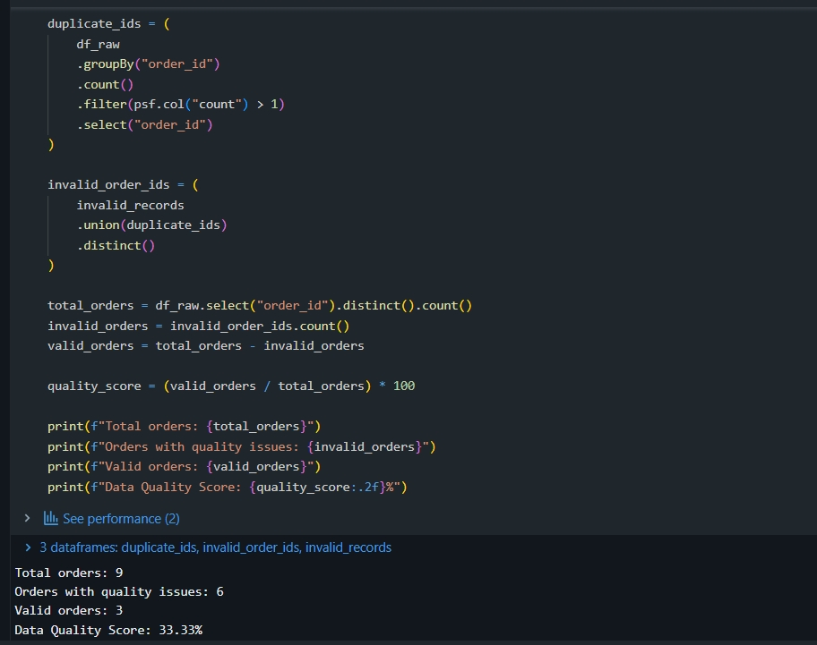
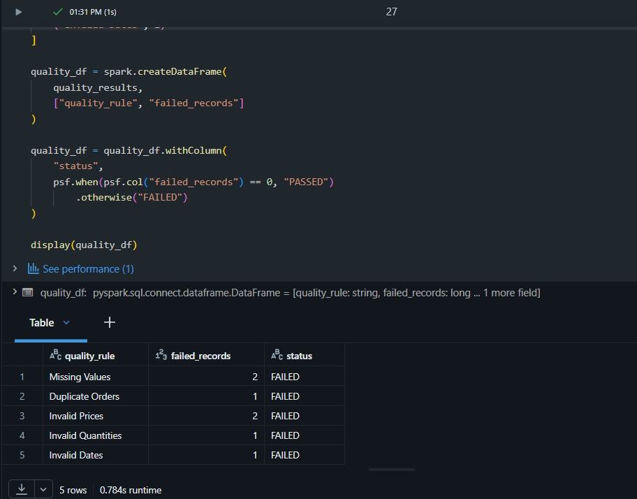

# E-Commerce Data Quality Pipeline

## About the project

This is a small data engineering project built in Databricks to check the quality of e-commerce order data before using it for analysis.

The dataset contains some common data quality problems, such as missing values, duplicated orders, invalid prices, incorrect quantities and invalid dates.

The goal is to identify these issues, keep the valid records and store the results of the quality checks.

## What the pipeline does

The pipeline follows these steps:

Raw data → Data quality checks → Clean data → Quality results

The original data is kept unchanged, while the validated records are stored separately.

## Data quality checks

The following checks are performed:

- Missing values
- Duplicate order IDs
- Invalid prices
- Invalid quantities
- Invalid dates

## Data structure

The project uses three Delta tables:

- raw_orders — original order data
- clean_orders — records that passed the validation rules
- quality_results — results from the data quality checks

## Results

The pipeline found several issues in the original dataset:

- Missing customer IDs
- Missing prices
- Duplicate orders
- Negative prices
- Invalid quantities
- Invalid dates

After applying the validation rules, the valid records were stored in the clean_orders table.

### Data Quality Score



### Quality Results



## Technologies

- Databricks
- PySpark
- Python
- SQL
- Delta Lake
- Unity Catalog

## Project structure

```text
ecommerce-data-quality-pipeline/
│
├── README.md
    └── 01_Data_Quality_Pipeline.ipynb

## Key Skills Applied

- Built data quality checks using PySpark in Databricks
- Worked with Delta tables and Unity Catalog
- Applied validation rules to identify common data quality issues
- Used PySpark and SQL for data exploration and validation
- Separated raw and validated data to maintain data traceability
- Persisted data quality results for further analysis
